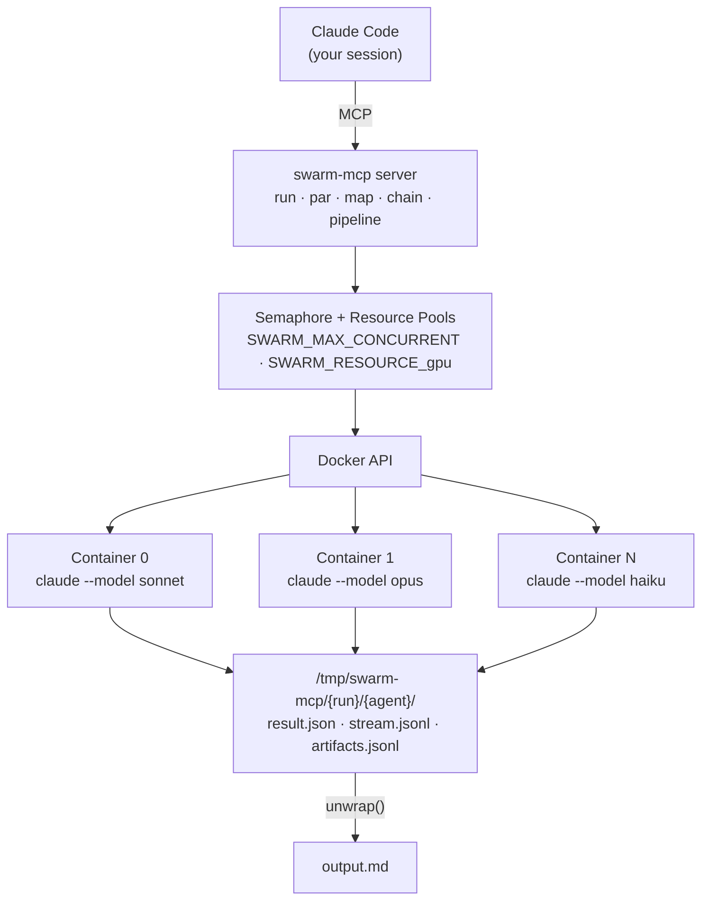
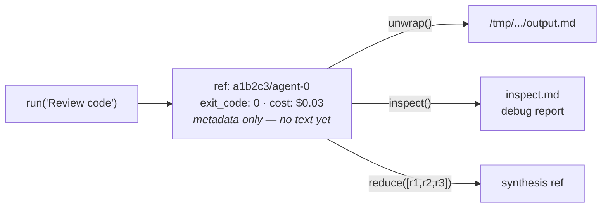
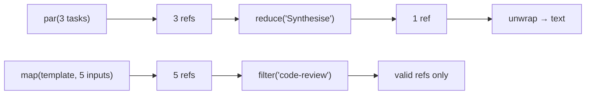

<!-- mcp-name: io.github.stiege/mcp-swarm -->
# swarm-mcp

**Orchestrate parallel Claude agent workloads via Docker containers.**

[](https://pypi.org/project/mcp-swarm/)
[](https://python.org)
[](LICENSE)
[](https://docker.com)
[](https://stiege.github.io/swarm-mcp/)

swarm-mcp is an MCP server that lets your Claude session spawn other Claude agents — each in an isolated Docker container — and compose their results using functional combinators. Instead of one agent doing everything, you describe the work as `run`, `par`, `map`, `chain`, `reduce`, and `pipeline` calls, and swarm-mcp handles container lifecycle, resource scheduling, and result plumbing. The agent outputs are lazy refs (metadata on the wire, text on disk) so you never blow up the MCP protocol with megabytes of agent output.

---

## Why swarm-mcp?

- **True Docker isolation per agent.** Every agent gets its own container with its own filesystem, network policy, memory limit, and CPU quota. No shared state leaks between agents. A rogue `rm -rf /` in one container doesn't touch anything else.

- **Monadic ref architecture (lazy by default).** Combinators return refs — small JSON objects with metadata (cost, duration, exit code, provenance hash). The actual text stays on disk in `/tmp/swarm-mcp/{run_id}/{agent_id}/result.json`. Call `unwrap` when you actually need the content. This keeps the MCP protocol fast and prevents context window bloat.

- **Free monad pipelines (computation as data).** The `pipeline` tool interprets a JSON definition — steps with `on_fail` handlers, `condition` guards, `retry_if` loops, and `next` jumps. The pipeline is data you can store, version, resume, and share. The interpreter handles control flow, budget tracking, and inter-step communication via a shared `/shared/` directory.

- **GPU and resource semaphores.** Named resource pools (`gpu`, `database`, `api`, anything) are semaphores with configurable capacity. Agents queue for resources before execution. A single GPU doesn't get double-booked; a rate-limited API doesn't get hammered.

- **Natural language type contracts with validation.** Types are markdown files that describe what an agent should produce. The `validate` tool spawns a validator agent that checks the output against the type definition. `filter` keeps only results that pass. `retry` re-runs until the output validates. Types reference each other with `[type-name]` syntax.

- **Agents can use your MCP servers.** Set `mcps: ["database-mcp"]` in a sandbox spec and the agent gets access to your local knowledge base, Logseq graph, Google Workspace, or any other MCP server configured in your Claude settings. Data paths are mounted into the container at the same host path; network MCPs need no extra config. See the [MCP Access guide](docs/concepts/mcps.md).

- **Full artifact tracing.** Every container runs a PostToolUse hook that logs MCP tool calls and file writes to `artifacts.jsonl`. `inspect` generates a post-mortem debug report from any ref. `unwrap` extracts output to a file you can `Read()` or `Grep`. Every ref carries a provenance hash and parent chain.

---

## Architecture



### Ref flow



### Combinator composition



---

## Installation

### Prerequisites

- **Docker** — containers are the execution substrate
- **Claude Code CLI** — with OAuth configured (`claude login`)
- **uv** — Python package manager

### Install

```bash
# Run directly
uvx mcp-swarm

# Or install as a tool
uv tool install mcp-swarm
```

### Configure Claude Code

Add to your Claude settings (`~/.claude.json` or project `.claude.json`):

```json
{
  "mcpServers": {
    "swarm": {
      "command": "uvx",
      "args": ["mcp-swarm"]
    }
  }
}
```

### Build the Docker image

The agent containers need a Docker image with Claude CLI and uv baked in. Clone the repo and build:

```bash
git clone https://github.com/stiege/swarm-mcp
cd swarm-mcp
docker build -t swarm-agent .
```

The Dockerfile installs Claude Code CLI and uv from their official sources during the build — no binaries to copy. The image is based on Ubuntu 24.04 with git, Python 3, and jq. It auto-builds on first use if missing, but pre-building avoids the startup delay.

---

## Quick Start

### 1. Single agent — code review

```
Use run to review this file:

run(
  prompt: "Review the error handling in /workspace/src/api/auth.py. Flag any unhandled exceptions, missing input validation, or security issues. Be specific — line numbers and fix suggestions.",
  model: "sonnet",
  mounts: '[{"host_path": "/home/me/myproject", "container_path": "/workspace", "readonly": true}]',
  tools: "Read,Glob,Grep"
)
```

Returns a ref with metadata. Use `unwrap` on the ref to read the full review.

### 2. Parallel research — three topics at once

```
Use par to research these topics in parallel:

par(
  tasks: '[
    {"prompt": "Research the current state of WebTransport API browser support. What works, what doesn'\''t, what'\''s coming.", "model": "sonnet"},
    {"prompt": "Research QUIC protocol performance characteristics vs TCP for real-time applications. Include benchmarks if available.", "model": "sonnet"},
    {"prompt": "Research existing open-source WebTransport server implementations. Compare features, maturity, language.", "model": "sonnet"}
  ]',
  max_concurrency: 3
)
```

Three containers spin up simultaneously. Each gets its own network, filesystem, and execution context. Results come back as an array of refs with a summary showing succeeded/failed counts.

### 3. Pipeline — write, test, fix loop

```
Use pipeline to implement and test a feature:

pipeline(
  definition: '{
    "name": "implement-and-test",
    "steps": [
      {
        "id": "implement",
        "prompt": "Implement a rate limiter middleware for Express.js. Use a sliding window algorithm. Write to /shared/rate-limiter.js",
        "model": "sonnet",
        "tools": "Read,Write,Bash"
      },
      {
        "id": "test",
        "prompt": "Write tests for /shared/rate-limiter.js using Jest. Run them. Report pass/fail.",
        "model": "sonnet",
        "tools": "Read,Write,Bash",
        "on_fail": "fix"
      },
      {
        "id": "fix",
        "prompt": "Fix the failing tests. Read the error output and fix either the implementation or the tests.",
        "model": "sonnet",
        "tools": "Read,Write,Bash",
        "condition": "prev.error",
        "next": "test",
        "max_retries": 3
      }
    ]
  }'
)
```

The pipeline writes code in step 1, tests it in step 2, and if tests fail, loops through the fix step up to 3 times. All steps share the `/shared/` directory for file passing.

---

## Combinators Reference

### Execution

| Combinator | Pattern | Use when |
|---|---|---|
| `run` | 1 prompt → 1 ref | Single agent task. The fundamental unit. |
| `par` | N prompts → N refs | Independent tasks that can run simultaneously. |
| `map` | 1 template + N inputs → N refs | Same operation applied to many inputs (fan-out). |
| `chain` | N prompts → 1 final ref (sequential) | Each step needs the previous step's output as context. |
| `reduce` | N refs + synthesis prompt → 1 ref | Combine multiple results into a single synthesis. |
| `map_reduce` | map + reduce in one call | Fan-out then synthesize — no manual plumbing. |

### Control Flow

| Combinator | Pattern | Use when |
|---|---|---|
| `filter` | N refs + type → valid refs | Keep only results that match a declared type. |
| `race` | N prompts → 1 winner ref | Multiple strategies, take the first success. |
| `retry` | 1 prompt + max_attempts → 1 ref | Flaky task that may need multiple tries. Optionally validates against a type. |
| `guard` | 1 ref + check → ref or error | Enforce constraints (validated, budget, classification, encrypted, exists) before passing downstream. |
| `pipeline` | JSON definition → execution trace | Multi-step workflow with conditions, retries, on_fail handlers, and budget/deadline tracking. |

### Observation

| Tool | Pattern | Use when |
|---|---|---|
| `unwrap` | ref → file path | You need the actual text content. Writes to `output.md`. |
| `inspect` | ref → debug report | Post-mortem on a failed or slow agent. Shows tool calls, stream log, artifacts. |

### Security

| Tool | Pattern | Use when |
|---|---|---|
| `encrypt` | ref → encrypted ref + key_id | Protect sensitive output at rest. Metadata stays readable; text is Fernet-encrypted on disk. |
| `decrypt` | encrypted ref + key_id → file path | Decrypt with the right key. Writes plaintext to `output.md`. |
| `classify` | ref + level → classified ref | Tag data sensitivity (public/internal/confidential/restricted). Controls which MCPs can access. |

### Types

| Tool | Pattern | Use when |
|---|---|---|
| `list_type_registry` | → list of types | See what types are defined. |
| `get_type_definition` | name → markdown content | Read a type definition, with [references] resolved. |
| `validate` | artifact + type → VALID/PARTIAL/INVALID | Check if an agent's output matches a declared type. |

### Configuration

| Tool | Pattern | Use when |
|---|---|---|
| `save_sandbox_spec` | name + JSON → saved | Create a reusable sandbox configuration. |
| `list_sandbox_specs` | → list of specs | See saved sandboxes. |
| `wrap` | file path → ref | Bring an external file/directory into the ref system. |
| `wrap_project` | project dir → registered resources | Register a project's pipelines/, sandboxes/, types/ directories. |

---

## Sandbox Configuration

A sandbox spec defines the environment for an agent container. Use inline on any combinator, or save with `save_sandbox_spec` for reuse.

| Field | Type | Default | Description |
|---|---|---|---|
| `model` | string | `"sonnet"` | Claude model: `haiku`, `sonnet`, `opus` |
| `tools` | list[string] | `["Read","Write","Glob","Grep","Bash"]` | Allowed Claude tools |
| `mcps` | list[string] | `[]` | MCP servers to attach (by name from host `~/.claude.json`). The server's code and config are mounted into the container; add data paths via `mounts`. See [MCP Access](docs/concepts/mcps.md). |
| `system_prompt` | string | `null` | System prompt injected via `--system-prompt` |
| `claude_md` | string | `null` | Written to workspace `CLAUDE.md` |
| `output_schema` | dict | `null` | JSON schema for structured output (`--json-schema`) |
| `effort` | string | `null` | Effort level: `low`, `medium`, `high`, `max` |
| `max_budget` | float | `null` | USD budget cap for the agent |
| `input_type` | string | `null` | Natural language type describing agent input |
| `output_type` | string | `null` | Natural language type describing expected output |
| `mounts` | list[dict] | `[]` | Volume mounts: `{"host_path", "container_path", "readonly"}` |
| `workdir` | string | `"/workspace"` | Container working directory |
| `input_files` | dict | `{}` | Files to inject: `{"/path": "content"}` |
| `network` | bool | `true` | Network access (needed for Anthropic API) |
| `memory` | string | `null` | Docker memory limit (e.g. `"2g"`) |
| `cpus` | float | `null` | Docker CPU limit (e.g. `2.0`) |
| `gpu` | bool | `false` | Pass `--gpus all` to Docker |
| `resources` | list[string] | `[]` | Named resource pools to acquire (e.g. `["gpu", "database"]`) |
| `timeout` | int | `1800` | Max execution time in seconds (30 min default) |
| `env_vars` | dict | `{}` | Environment variables: `{"KEY": "value"}` |

### Complete example

```json
{
  "model": "sonnet",
  "tools": ["Read", "Write", "Glob", "Grep", "Bash"],
  "system_prompt": "You are a senior backend engineer. Write production-quality Go code.",
  "claude_md": "# Project\nThis is a Go microservice using chi router and pgx for Postgres.",
  "mounts": [
    {"host_path": "/home/me/myservice", "container_path": "/workspace", "readonly": false}
  ],
  "mcps": ["database-mcp"],
  "memory": "4g",
  "cpus": 2.0,
  "timeout": 600,
  "effort": "high",
  "env_vars": {"GOPATH": "/home/ubuntu/go"},
  "output_type": "[go-module]"
}
```

Save it:

```
save_sandbox_spec(name: "go-backend", spec: '<the JSON above>')
```

Then use it anywhere:

```
run(prompt: "Add pagination to the /users endpoint", sandbox: "go-backend")
par(tasks: '[{"prompt": "...", "sandbox": "go-backend"}, ...]')
```

---

## Pipelines (Free Monad)

A pipeline definition is a program expressed as data. The `pipeline` tool is the interpreter. You describe what should happen — steps, control flow, error handling — and the interpreter evaluates it, managing shared state and resource budgets.

### Why "free monad"?

Because the pipeline definition is a data structure that describes computation without executing it. You can store it as JSON, version it in git, share it across projects, and resume it from any step. The interpreter handles the effects: spawning containers, tracking costs, enforcing deadlines, and routing control flow.

### Complete pipeline example

```json
{
  "name": "research-and-report",
  "budget": 2.00,
  "deadline_seconds": 1800,
  "classification": "internal",
  "steps": [
    {
      "id": "gather",
      "prompt": "Research the top 5 Rust web frameworks by GitHub stars. For each, note: name, stars, last commit date, key features. Write a JSON summary to /shared/frameworks.json",
      "model": "sonnet",
      "tools": "Read,Write,Bash"
    },
    {
      "id": "benchmark",
      "prompt": "Read /shared/frameworks.json. For each framework, find or estimate request throughput benchmarks. Write results to /shared/benchmarks.json",
      "model": "sonnet",
      "tools": "Read,Write,Bash"
    },
    {
      "id": "draft",
      "prompt": "Read /shared/frameworks.json and /shared/benchmarks.json. Write a comparative analysis report to /shared/report.md. Include a recommendation.",
      "model": "opus",
      "tools": "Read,Write",
      "on_fail": "fix-draft"
    },
    {
      "id": "fix-draft",
      "prompt": "The report draft failed. Read the error, fix the issues, and rewrite /shared/report.md",
      "model": "sonnet",
      "tools": "Read,Write",
      "condition": "prev.error",
      "next": "review",
      "max_retries": 2
    },
    {
      "id": "review",
      "prompt": "Read /shared/report.md. Check for factual accuracy, missing data, and unclear recommendations. Write feedback to /shared/review.md. If the report is good, just write 'APPROVED'.",
      "model": "opus",
      "tools": "Read,Write",
      "retry_if": {"draft": "NEEDS_REVISION"}
    }
  ]
}
```

### Step fields

| Field | Type | Description |
|---|---|---|
| `id` | string | Step identifier (used by `on_fail`, `next`, `retry_if`). Defaults to `step-{i}`. |
| `prompt` | string | The task prompt. Previous step's output is appended as context automatically. |
| `on_fail` | string \| dict | Step ID to jump to on failure, or `{"monad": "Name"}` for LLM-governed decision. |
| `on_success` | dict | `{"monad": "Name"}` — LLM-governed decision evaluated after a successful step. |
| `next` | string | Step ID to jump to after success (instead of next sequential step). |
| `condition` | string | `"prev.error"` — only run this step if the previous step failed. |
| `max_retries` | int | Max times this step can be entered via `on_fail`/`next` jumps (default: 3). |
| `retry_if` | dict | `{"target_step": "keyword"}` — if output contains keyword, jump to target step. |
| + any sandbox field | | `model`, `tools`, `system_prompt`, `timeout`, etc. |

### Pipeline-level fields

| Field | Type | Description |
|---|---|---|
| `name` | string | Pipeline name (optional). |
| `sandbox` | string | Default sandbox spec applied to all steps. |
| `budget` | float | Total USD budget. Pipeline stops if exceeded. |
| `deadline_seconds` | int | Wall-clock deadline. Pipeline stops if exceeded. |
| `classification` | string | Default data classification for the run. |
| `monads` | dict | Inline monad specs keyed by name. Per-project, version-controlled alongside the pipeline. |

### Pipeline status

The `pipeline` tool returns a `status` field: `"done"` (all steps completed) or `"broken"` (last result had an error, or a monad returned `broken`). A `broken_reason` field is included when applicable. Broken pipelines can be inspected via `pipeline_status`.

### The /shared/ directory

Every step in a pipeline gets `/shared/` mounted read-write. This is the inter-step communication channel. Step 1 writes `/shared/data.json`, step 2 reads it. No ref passing needed — just files.

### Resuming

```
pipeline(definition: "research-and-report", resume: "a1b2c3d4e5f6")
pipeline(definition: "research-and-report", resume: "a1b2c3d4e5f6/benchmark")
```

- `resume: "run_id"` — reuses the shared directory from a previous run, starts from step 0.
- `resume: "run_id/step_id"` — skips to the named step, previous artifacts available in `/shared/`.

---

## LLM-Governed Monads

Monads are LLM-powered control-flow decisions evaluated at pipeline trigger points (`on_fail`, `on_success`). They replace hardcoded fallback logic with natural language policy — the monad spec describes the decision in plain English, and a Claude model evaluates it against the live pipeline state.

Unlike the ref decoration layer (`stamps.py` — provenance, cost, classification, encryption), monads are about control flow.

### Continuation algebra

Every monad returns one of five actions:

| Action | Effect |
|--------|--------|
| `next` | Proceed to the next step normally |
| `jump` | Jump to a named step (`target` field) |
| `halt` | Stop the pipeline cleanly (status: `done`) |
| `broken` | Stop and mark pipeline as broken with a `reason` |
| `patch_pipeline` | Deep-merge patch the pipeline definition, then continue |

The `context` dict is free-form, accumulates across the pipeline, and is written to `/shared/monad-context.json` after each evaluation so steps can read it.

### Inline pipeline monads

Define monads directly in the pipeline JSON — version-controlled alongside the pipeline, no global registration needed:

```json
{
  "name": "train-loop",
  "monads": {
    "TrainingFailure": {
      "description": "Governs QLoRA train step failures",
      "model": "claude-haiku-4-5-20251001",
      "spec": "You govern the train step of a QLoRA fine-tuning pipeline. OOM errors → broken. NaN/loss divergence → broken. Transient errors (disk, timeout) → jump to the step before train to retry data preparation. Inspect exit_code and error output."
    },
    "QualityGate": {
      "description": "Decides whether the current model iteration is good enough",
      "model": "claude-haiku-4-5-20251001",
      "spec": "You govern the evaluation step. If the pass rate is 5/5, return halt (we're done). If 3-4/5, jump to the training step for another iteration. If 0-2/5, return broken — the model is not converging."
    }
  },
  "steps": [
    {"id": "train",    "prompt": "...", "on_fail":    {"monad": "TrainingFailure"}},
    {"id": "evaluate", "prompt": "...", "on_success": {"monad": "QualityGate"}}
  ]
}
```

Global fallback: `~/.claude/monads/` (managed by `save_monad_spec` / `list_monad_specs`). Inline definitions take priority over global ones.

### The patch_pipeline action

A monad can surgically modify the running pipeline definition. This uses JSON Merge Patch (RFC 7396) — null values delete keys, objects recurse, scalars/arrays replace:

```json
{
  "action": "patch_pipeline",
  "pipeline_patch": {
    "steps": [
      {"id": "train", "prompt": "Run training with --batch-size 4 instead of 8"}
    ]
  },
  "context": {"adjusted_batch_size": true},
  "reason": "Detected instability in loss curve — reducing batch size"
}
```

### monad_context

The context dict from each monad continuation is merged into a running `monad_context` that persists across the entire pipeline. Written to `/shared/monad-context.json` so steps can read it. Use it to pass structured observations between monads (e.g., iteration count, last loss value, retry history).

---

## Type System

Types are natural language specifications stored as markdown files in a `types/` directory. They describe what something is, what it should contain, and how to verify it.

### Defining a type

Create `types/code-review.md`:

```markdown
A code review document that covers:

1. **Summary** — one paragraph describing what the code does
2. **Issues** — numbered list of problems found, each with:
   - Severity (critical / warning / nit)
   - File and line number
   - Description of the problem
   - Suggested fix
3. **Security** — specific section for security concerns (XSS, injection, auth)
4. **Testing** — assessment of test coverage and suggestions

## Verification
- Has a Summary section
- Has at least one numbered issue with severity, location, and fix
- Has a Security section (even if "no issues found")
- Has a Testing section
```

### Using types

Set `input_type` or `output_type` on any combinator to inject type context into the agent's prompt:

```
run(
  prompt: "Review the auth module",
  output_type: "code-review",
  mounts: '[{"host_path": "/home/me/project", "container_path": "/workspace", "readonly": true}]'
)
```

### Validating

```
validate(artifact: '{"ref": "a1b2c3/agent-0"}', declared_type: "code-review")
```

Returns `VALID`, `PARTIAL`, or `INVALID` with per-criterion results.

### Type references

Types can reference other types with `[type-name]` syntax:

```markdown
# types/api-server.md
A REST API server that includes:
- Route handlers with input validation
- Error handling middleware
- [test-suite] with integration tests
- [dockerfile] for containerized deployment
```

References are resolved recursively (up to depth 3). Each referenced type is inlined once; subsequent references become "(see above)".

### Registering types

```
wrap_project(project_dir: "/home/me/myproject")
```

This registers `myproject/types/`, `myproject/sandboxes/`, and `myproject/pipelines/` as search paths. Types in the project take priority over global types in `~/.claude/types/`.

---

## Resource Pools & GPU

### GPU access

```
run(
  prompt: "Fine-tune the sentiment classifier on the new dataset",
  gpu: true,
  mounts: '[{"host_path": "/data/models", "container_path": "/models", "readonly": false}]'
)
```

Setting `gpu: true` does two things:
1. Passes `--gpus all` to the Docker container
2. Acquires the `"gpu"` resource pool (capacity 1 by default)

If another agent is using the GPU, this one queues until the resource is free.

### Named resource pools

Any string in the `resources` array becomes a semaphore. Configure capacity with environment variables:

```bash
# One GPU at a time (default)
export SWARM_RESOURCE_gpu=1

# Up to 3 concurrent database connections
export SWARM_RESOURCE_database=3

# Rate-limit external API access to 5 concurrent agents
export SWARM_RESOURCE_api=5
```

Use in a run call:

```
run(
  prompt: "Query the production database for user analytics",
  resources: '["database"]',
  mcps: '["database-mcp"]'
)
```

### Queue semantics

Resource acquisition uses a separate timeout (`SWARM_QUEUE_TIMEOUT`, default 1 hour) from execution timeout. An agent waiting 10 minutes for a GPU still gets its full execution time once the GPU is available. The global concurrency limit (`SWARM_MAX_CONCURRENT`) is acquired first, then named resources.

---

## Observability

### unwrap — extract text to file

```
unwrap(ref: "a1b2c3/agent-0")
```

Writes the agent's full text output to `/tmp/swarm-mcp/a1b2c3/agent-0/output.md` and returns the path and size. Use `Read()` to view it. This is how you go from a lazy ref to actual content.

### inspect — post-mortem debug

```
inspect(ref: "a1b2c3/agent-0")
```

Generates a debug report at `inspect.md` containing:
- Result metadata (exit code, error, duration, cost)
- Output text (first 2000 chars)
- Stream log summary (tool calls made, thinking steps)
- Artifacts logged by the PostToolUse hook
- Files in the output directory

### Artifact tracing

Every agent container runs a PostToolUse hook (`hooks/log-artifacts.sh`) that captures MCP tool calls and file writes to `/output/artifacts.jsonl`. Each entry records:

```json
{
  "timestamp": "2025-01-15T10:30:00Z",
  "tool": "Write",
  "tool_use_id": "toolu_abc123",
  "input": {"file_path": "/workspace/src/main.py", "content": "..."},
  "response": {"success": true}
}
```

This gives you a complete audit trail of what every agent did inside its container.

### Encrypted refs

The `encrypt` / `decrypt` flow protects sensitive outputs at rest:

```
run(prompt: "Extract PII from the uploaded documents")
  │
  ▼
encrypt(ref: "a1b2c3/agent-0")
  │
  ▼
{ "ref": "a1b2c3/agent-0",       ◄── metadata visible
  "key_id": "f9e8d7c6b5a4",      ◄── needed to decrypt
  "encrypted": {                   ◄── text is Fernet-encrypted on disk
    "key_id": "f9e8d7c6b5a4",
    "algorithm": "fernet"
  }}
  │
  ├── unwrap() ──► ERROR: "Ref is encrypted. Use decrypt tool."
  │
  └── decrypt(ref: "a1b2c3/agent-0", key_id: "f9e8d7c6b5a4") ──► output.md
```

The key is stored in `/tmp/swarm-mcp/.keys/` with `0600` permissions. Only processes with the key_id can access the plaintext. The ciphertext stays in `result.json` — `decrypt` writes the plaintext to a separate `output.md` without replacing the encrypted copy.

### Classification flow

```
classify(ref: "a1b2c3/agent-0", level: "confidential", denied_mcps: '["whatsapp", "slack"]')
  │
  ▼
guard(ref: '<classified ref>', check: "classification", value: '["slack"]')
  │
  ▼
ERROR: "MCP 'slack' denied for classification 'confidential'"
```

Classification levels: `public` (0) → `internal` (1) → `confidential` (2) → `restricted` (3). Use `guard` with the `"classification"` check to enforce data flow policies before passing refs to downstream agents with MCP access.

---

## On-Disk Layout

Every agent execution produces a directory under `/tmp/swarm-mcp/`:

```
/tmp/swarm-mcp/
└── a1b2c3d4e5f6/              ← run_id
    ├── agent-0/                ← agent_id
    │   ├── result.json         ← full output + metadata
    │   ├── stream.jsonl        ← raw stream-json from claude
    │   ├── artifacts.jsonl     ← PostToolUse hook log
    │   ├── output.md           ← created by unwrap()
    │   ├── inspect.md          ← created by inspect()
    │   ├── prompt.txt          ← the prompt sent to the agent
    │   ├── home/               ← staged HOME dir mounted into container
    │   │   ├── .claude/        ← claude config + settings + hooks
    │   │   └── .claude.json    ← oauth + mcp config
    │   └── workspace/          ← mounted as /workspace in container
    │       └── CLAUDE.md       ← injected from sandbox spec
    ├── agent-1/
    │   └── ...
    └── shared/                 ← pipeline shared directory (/shared/ in containers)
        ├── data.json
        └── report.md
```

---

## Environment Variables

| Variable | Default | Description |
|---|---|---|
| `SWARM_MAX_CONCURRENT` | `10` | Maximum agents running simultaneously across all combinators. |
| `SWARM_QUEUE_TIMEOUT` | `3600` | Seconds an agent will wait in the queue for an execution slot or resource pool. |
| `SWARM_RESOURCE_<name>` | `1` | Capacity of a named resource pool. e.g. `SWARM_RESOURCE_gpu=1`, `SWARM_RESOURCE_database=3`. |
| `SWARM_PROJECT_DIR` | unset | Project root containing `pipelines/`, `sandboxes/`, `types/` directories. Added to search paths on startup. |

---

## Contributing

See [CONTRIBUTING.md](CONTRIBUTING.md).

---

## License

MIT
