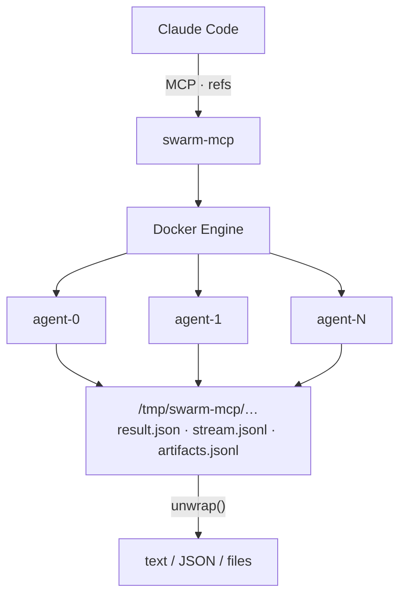

# swarm-mcp

**Turn Claude Code into a parallel agent runtime.**

swarm-mcp is an MCP server that gives Claude the ability to spawn other Claude agents — each running in an isolated Docker container — and compose their work using functional combinators. Run 10 code reviews simultaneously. Fan out research across 20 topics. Build multi-step pipelines that retry on failure, gate on type-checked outputs, and share state through a filesystem.

One Claude session. Many agents working in parallel.

---

## Why it's different

Most "agent orchestration" is just Claude calling itself in a loop, sharing the same context window and the same process. swarm-mcp is different in every dimension that matters:

**Each agent is truly isolated.** Every `run()` spawns a fresh Docker container with its own filesystem, network policy, memory limit, and process space. A rogue agent can't corrupt another's state. An infinite loop gets killed by the timeout. A `rm -rf /` stays inside the container. You control exactly which tools and MCP servers each agent can access.

**Outputs are lazy refs, not text.** Combinators return lightweight metadata handles — cost, duration, exit code, provenance hash — without materialising the output text. Text stays on disk until you call `unwrap()`. This means a pipeline that fans out to 50 agents doesn't flood the MCP protocol with 50 agent responses. You pick and choose what to read.

**Pipelines are data, not code.** The `pipeline` tool interprets a JSON definition — steps, `on_fail` handlers, `condition` guards, `retry_if` loops, `next` jumps — the way an interpreter runs a program. The pipeline definition is something you can store in git, version, resume from any step, and share across projects. The interpreter handles the effects: container lifecycle, budget tracking, deadlines, shared file state.

**The type system validates meaning, not structure.** You write types as markdown files describing what an agent should produce — not a JSON schema, not a Pydantic model, but prose that another Claude reads and reasons about. "The analysis must identify at least 3 risk factors." "The code must not contain hardcoded credentials." "The recommendation must cite a specific source." A validator agent reads your type definition and the output together, then issues `VALID`, `PARTIAL`, or `INVALID` with per-criterion feedback. `filter()` keeps only valid refs. `retry()` loops until the output validates.

**Agents can use your MCP servers.** Set `mcps: ["database-mcp"]` in a sandbox and the agent gets access to your knowledge base. Set `mcps: ["google-workspace"]` and it can read your email. The host `.claude.json` is copied into the container; MCP server code is mounted at the same path. Agents are powerful because they inherit your tool infrastructure.

---

## What you can build

```
map_reduce(
  template="Summarise the key claims in this paper: {input}",
  inputs=["paper1.pdf", "paper2.pdf", ..., "paper20.pdf"],
  synthesis="Compare the 20 summaries. Identify consensus, contradictions, and gaps."
)
```
→ Literature review of 20 papers, parallel fetch and summarise, single synthesised report.

```
pipeline({
  steps: [
    {id: "implement", prompt: "Write the feature"},
    {id: "test",      prompt: "Write and run tests", on_fail: "fix"},
    {id: "fix",       prompt: "Fix failing tests", next: "test", max_retries: 5}
  ]
})
```
→ Code generation loop that doesn't stop until tests pass.

```
par([
  {prompt: "Security audit",    output_type: "security-report"},
  {prompt: "Performance audit", output_type: "performance-report"},
  {prompt: "Dependency audit",  output_type: "dependency-report"}
])
→ filter each by type → reduce into a single release readiness report
```
→ Type-validated parallel audit, synthesised into a go/no-go decision.

---

## The architecture in one picture



Combinators return refs. Refs compose. `unwrap()` materialises text only when you need it.

---

## How it fits into the ecosystem

The Claude Code extension landscape is crowded with single-agent coding assistants — Cline, Aider, OpenHands, Continue. They improve the loop of *one* agent editing *one* codebase. swarm-mcp is a different layer entirely: it orchestrates *many* agents working in parallel, with typed contracts between them.

**vs coding assistants (Cline, Aider, Continue):** Those tools automate the edit-run-fix loop for a single agent. swarm-mcp sits above that — you can use swarm-mcp to run 10 specialised agents simultaneously, then synthesise their results.

**vs OpenHands:** OpenHands runs one autonomous agent in a Docker sandbox targeting SWE-bench tasks. swarm-mcp gives you *N* containers, functional combinators to compose their work, a type system to validate outputs, and a pipeline interpreter to chain them with error recovery.

**vs OpenClaw (191k ⭐):** A personal AI assistant with 50+ messaging platform adapters (WhatsApp, Telegram, Discord). A different product category entirely — no Docker isolation per agent, no type contracts, not designed for developer workloads. The star count reflects breadth of use, not overlap with swarm-mcp's niche.

swarm-mcp's niche: **programmable multi-agent orchestration from within Claude Code**, with production-grade isolation, composability, and type safety.

---

## Get started

- [Installation](installation.md) — install swarm-mcp, build the Docker image, wire into Claude Code
- [Quickstart](quickstart.md) — your first agent, pipeline, and type-validated workflow in 10 minutes
- [Concepts: Refs](concepts/refs.md) — the monadic architecture in depth
- [Concepts: Combinators](concepts/combinators.md) — all 21 tools with examples
- [Concepts: Types](concepts/types.md) — semantic validation with natural language types
- [Concepts: MCP Access](concepts/mcps.md) — giving agents access to your knowledge base and tools
